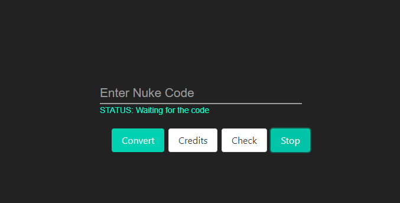
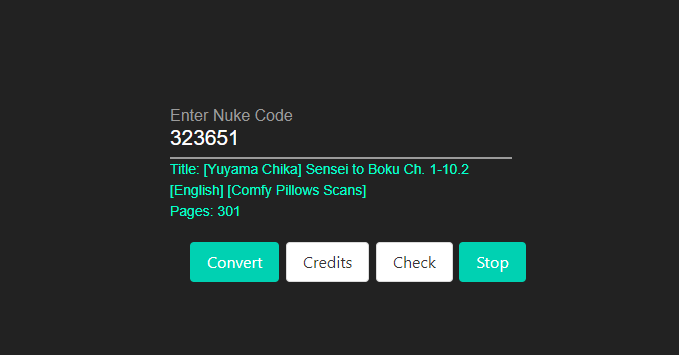

<h1 align="center">Welcome to Project Darkness-Chan</h1>

  </a>
    
  </a>
  

# Darkness_chan
GUI[Graphical User Interface] based program to download doujin in pdf format using code uwu. Stay Cultured

 
 

## Prerequisites

- Stable Internet Connection

## Instructions to run the program

1. Download Darkness-chan [Any available Compatible Version for your OS]
2. Run the program as "Administrator" or SUDO also disable Anti-Virus if it's conflicting with download.

## Author

👤 **Somnath Das**

* Twitter: [@aksd3247](https://twitter.com/aksd3247)
* Github: [@SomnathDas](https://github.com/SomnathDas)
* Instagram: [@samurai3247](https://www.instagram.com/samurai3247/)

## 🤝 Contributing

Contributions, issues and feature requests are welcome! Feel free to check [issues page](https://github.com/SomnathDas/DoujinCodeToPdf/issues). 

## Show your support

Give a ⭐️ if this project helped you!
